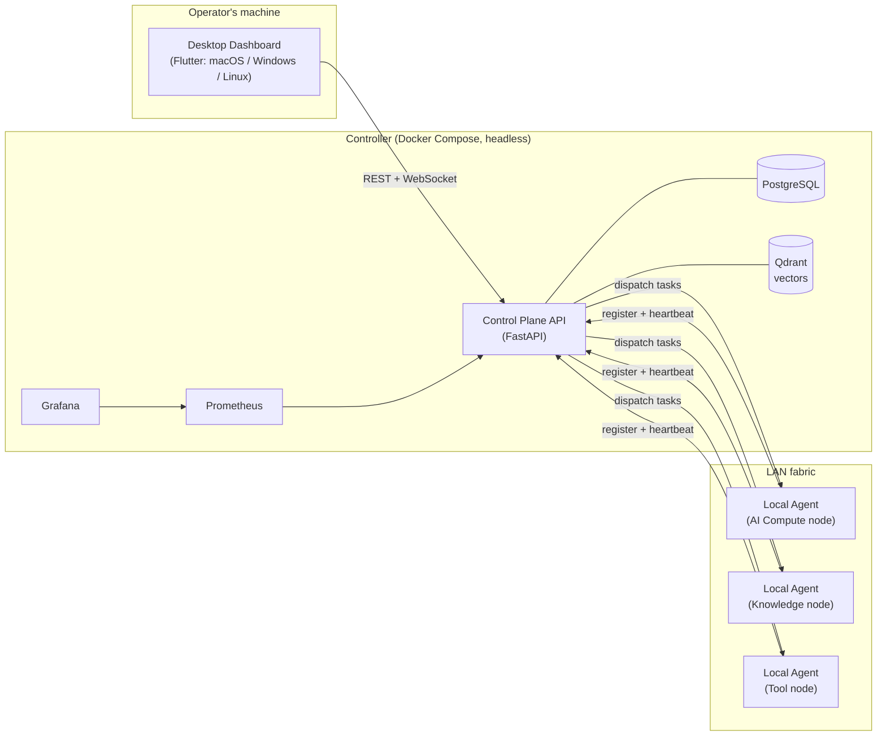

<div align="center">


# Lycosa

**AI Operations Layer for Local and Cloud AI Agents**

Turn the devices you already own into one cooperative AI execution fabric.

[](LICENSE)
[](https://github.com/abdra7/Lycosa/releases/latest)
[](https://github.com/abdra7/Lycosa/actions/workflows/ci.yml)

</div>

---

**Lycosa** is a LAN-first, distributed multi-agent AI orchestration platform.
It turns workstations, laptops, homelab boxes, and mini-PCs into one
cooperative AI execution fabric. Each device runs a Local Agent that can host
a local LLM (Ollama first), tools, and metrics; a central controller
discovers devices, recommends each one a role based on its hardware,
schedules tasks with failover, routes knowledge (RAG) requests, runs
multi-step workflows with human approval gates, and streams everything live
to a native desktop dashboard.

## Features

- **Device roles, automatically recommended** — every node is profiled at
  registration and recommended one of **AI Compute · Hybrid · Knowledge ·
  Tool · Vision · Storage**, with a human-readable rationale and per-role
  confidence scores. Accept the recommendation or override it.
- **Task scheduling with failover** — the scheduler places work by role and
  capacity and retries on the next best candidate when a node drops.
- **Knowledge routing (RAG)** — upload documents into collections, embed
  them locally, and retrieve across the fabric with a built-in playground.
- **Workflows with approval gates** — multi-step runs that pause for a
  human decision before continuing.
- **LAN discovery** — running agents announce themselves over mDNS; the
  dashboard finds every machine running `lycosa-agent` on your network.
- **Live operations view** — REST + WebSocket streaming into a native
  desktop dashboard (macOS / Windows / Linux), with Prometheus and Grafana
  for metrics.

## Architecture



See [docs/DECISIONS.md](docs/DECISIONS.md) for the architecture decision log.

## Installation

Lycosa has **two parts installed separately**:

1. the **controller** — a headless Docker Compose stack (API, PostgreSQL,
   Qdrant, Prometheus, Grafana) on your server or main machine;
2. the **desktop dashboard** — a native app on the operator's machine,
   downloaded from GitHub Releases (not a container).

### 1. Controller (server / main machine)

Prerequisites: [Docker](https://docs.docker.com/get-docker/) with Compose v2,
and `git`.

```bash
curl -fsSL https://raw.githubusercontent.com/abdra7/Lycosa/main/scripts/install.sh | bash
```

or from a clone:

```bash
git clone https://github.com/abdra7/Lycosa.git
cd Lycosa
./scripts/install.sh
```

On Windows hosts, use PowerShell: `.\scripts\install.ps1`

The installer checks Docker, generates secrets into `.env`, asks for your
admin email/password, starts the stack, and prints the **controller URL**
(e.g. `http://192.168.1.10:8000`) to enter in the desktop app. Every setting
lives in the root `.env` — see `.env.example` for what exists.

Prefer plain compose? `cp .env.example .env`, edit it, then:

```bash
docker compose -f infra/docker-compose.yml up --build -d
```

Local endpoints once up: API docs at `http://localhost:8000/docs`, Prometheus
at `:9090`, Grafana at `:3001`.

### 2. Desktop dashboard (operator's machine)

Download the installer for your OS from the
[latest release](https://github.com/abdra7/Lycosa/releases/latest):

| OS | Artifact |
|---|---|
| macOS | `Lycosa-macos-<version>.dmg` |
| Windows | `Lycosa-windows-setup-<version>.exe` |
| Linux | `Lycosa-linux-<version>.AppImage` (or `.tar.gz`) |

Launch it, enter the controller URL printed by the installer, and log in with
the admin credentials you chose. Credentials are kept in the OS keychain;
multiple controller profiles are supported.

### 3. Add nodes (each participating device)

In the dashboard, **Nodes → Add node** mints a one-time node API key and
shows the exact commands to run on the new machine:

```bash
# install the agent (Python 3.11+; installs pipx if needed)
curl -fsSL https://raw.githubusercontent.com/abdra7/Lycosa/main/scripts/install-agent.sh | bash

# join the fabric
LYCOSA_CONTROLLER_URL=http://<controller-host>:8000 \
LYCOSA_API_KEY=lyc_... \
lycosa-agent run
```

On Windows, use `scripts/install-agent.ps1` instead — it also opens the
firewall ports discovery needs (see below), so LAN scan works without any
manual Windows Firewall or network-profile steps.

The node registers itself, gets a recommended role, and starts heartbeating.
See [agent/README.md](agent/README.md) for configuration and running the
agent as a systemd service.

### Finding devices on the LAN

Running agents announce themselves over mDNS (`_lycosa-agent._tcp`). In the
dashboard, **Nodes → Discovered on LAN → Scan** lists every machine running
`lycosa-agent` on your network and flags the ones not yet registered with
the controller. Discovery is advisory — joining the fabric still uses the
minted-key flow above. Set `LYCOSA_DISCOVERY_ENABLED=false` on an agent to
opt out.

The Windows installers (`install.ps1`, `install-agent.ps1`) open the ports
below automatically. If you installed another way, or devices still don't
appear, check firewalls on both ends:

| Port | Protocol | Machine | Used for |
|---|---|---|---|
| 8000 | TCP | controller host | REST API + dashboard traffic |
| 8010 | TCP | each agent | task dispatch (agent exec API) |
| 5353 | UDP (multicast) | agents + dashboard machine | mDNS discovery |

The agent binds `0.0.0.0` by default and advertises its detected LAN IP; on
multi-homed machines set `LYCOSA_ADVERTISE_URL` to the address the
controller can actually reach.

## Screenshots

<!--
Add screenshots of the dashboard here once captured, e.g.:
<p align="center"></p>
-->

*Screenshots of the redesigned dashboard are coming with the next release.*

## Deploy modes

- **Single machine** — controller and one agent on the same box: a personal
  AI workstation with dashboards, RAG, and workflows.
- **Multi-machine LAN** (the sweet spot) — controller on an always-on box,
  agents on every device worth using; the scheduler places work by role and
  capacity, with automatic failover between candidates.
- **Compose-only / headless** — run just the controller stack and drive it
  entirely over the REST API (`/docs`) without the desktop app.

## Roadmap

- Node decommissioning (remove stale nodes from the inventory)
- Async task queue behind `POST /tasks` (202 + polling)
- Re-embed job when a knowledge collection switches embedding backend
- mTLS / enrollment handshake for agent exec API hardening
- Redis-backed rate limiting for horizontal API scaling
- Kubernetes manifests under `infra/` (the controller is a single-process
  design today)

See [docs/BACKLOG.md](docs/BACKLOG.md) for the full backlog.

## Repository layout

| Directory | Contents |
|---|---|
| `backend/` | FastAPI control plane (orchestrator, scheduler, knowledge router, …) |
| `agent/` | Local Agent runtime installed on each node |
| `dashboard/` | Flutter Desktop operator dashboard (native macOS/Windows/Linux) |
| `infra/` | Docker Compose, Prometheus/Grafana config, future k8s manifests |
| `docs/` | Architecture decision log, backlog, brand assets |
| `scripts/` | Install and release tooling |

## Development

Backend (Python 3.11+):

```bash
cd backend
python -m venv .venv && source .venv/bin/activate   # Windows: .venv\Scripts\activate
pip install -e ".[dev]"
pytest                        # run tests
ruff check . && ruff format --check .               # lint
uvicorn app.main:app --reload # run the API locally
```

Agent: same commands from `agent/`. Dashboard: `flutter pub get`,
`flutter test`, `flutter run -d macos|windows|linux` from `dashboard/`.

Releases are cut by tagging `v*` — CI builds the backend image (GHCR) and
the three desktop installers and attaches them to the GitHub Release. See
[CHANGELOG.md](CHANGELOG.md) for release history.

## Contributing

Contributions are welcome! See [CONTRIBUTING.md](CONTRIBUTING.md) for
branching, commit, and code conventions, and
[CODE_OF_CONDUCT.md](CODE_OF_CONDUCT.md) for community guidelines.

## Security

LAN-first means the controller expects to live on a trusted network; see
[SECURITY.md](SECURITY.md) for the threat model, hardening notes, and how to
report vulnerabilities.

## License

Lycosa is released under the [MIT License](LICENSE).
