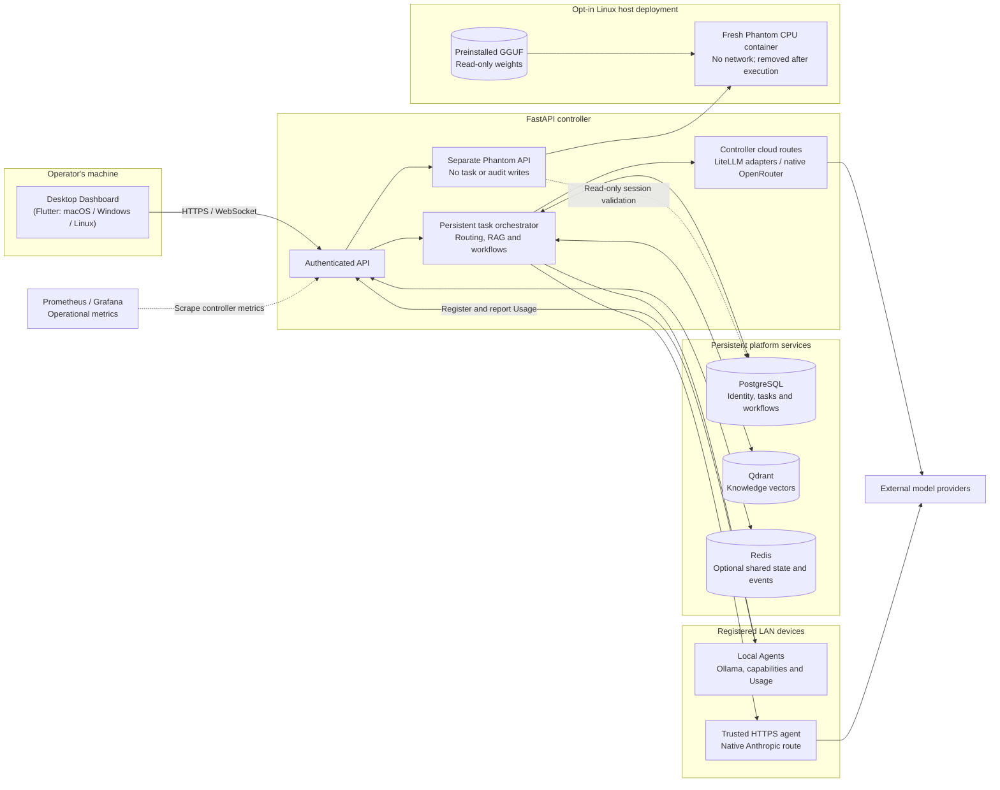

<div align="center">


# Lycosa — Local, Cloud & Ephemeral AI Orchestration

Created and maintained by [abdra7](https://github.com/abdra7).

**Local Agents · Provider Adapters · Phantom Agents**

Coordinate your own devices, approved cloud models, and isolated local inference
from one desktop dashboard.

[](LICENSE)
[](https://github.com/abdra7/Lycosa/releases/latest)
[](https://github.com/abdra7/Lycosa/actions/workflows/ci.yml)

</div>

---

**Lycosa** is a LAN-first AI orchestration platform with three execution paths:
**Local Agents** on your devices, **Provider Adapters** for approved cloud models,
and **Phantom Agents** for ephemeral inference in an isolated local container.
A FastAPI controller manages routing, knowledge retrieval (RAG), workflow
approvals and Usage telemetry. A Flutter desktop dashboard brings those controls
together on Windows, macOS and Linux.

Normal tasks retain their results and operational history. Phantom tasks use a
separate API and dialog, return an answer once, and bypass persistent task
history. Both cloud adapters and Phantom execution require explicit setup.

## Features

- **Universal LLM layer** — one provider-independent interface for OpenAI,
  Anthropic (Claude), Google Gemini, DeepSeek, Qwen, xAI (Grok), Mistral,
  OpenRouter, Ollama, LM Studio, vLLM and any OpenAI-compatible endpoint.
  Users connect their own provider accounts (several per provider), keys are
  encrypted on the controller, models are discovered with their documented
  capabilities, and per-purpose routes give a default model with automatic
  fallback, retries, streaming and usage/cost tracking.
- **Phantom Agents** — opt-in local CPU inference in a fresh, network-disabled
  Docker container for each request. Output is returned after container removal
  is confirmed and cleared from the desktop dialog after 60 seconds.
- **Provider Adapters** — opt-in controller-side text inference through LiteLLM,
  with 21 built-in provider identifiers and administrator-defined aliases.
  Exact model allowlists and explicit credentials control execution; tasks marked
  `requires_privacy` reject external providers.
- **Local Agents** — registered devices provide Ollama inference, model inventory,
  hardware profiles and live Usage telemetry. An optional MCP stdio companion
  exposes bounded capability, model-listing and evidence-answering tools.
- **Device roles, automatically recommended** — every node is profiled at
  registration and recommended one of **AI Compute · Hybrid · Knowledge ·
  Tool · Vision · Storage**, with a human-readable rationale and per-role
  confidence scores. Accept the recommendation or override it.
- **Task scheduling** — the scheduler places work by role and
  capacity and retries on the next best candidate when a node drops.
- **Knowledge routing (RAG)** — upload documents into collections, embed
  them locally, and retrieve across the fabric with a built-in playground.
- **Workflows with approval gates** — multi-step runs that pause for a
  human decision before continuing.
- **LAN discovery** — running agents announce themselves over mDNS; the
  dashboard finds every machine running `lycosa-agent` on your network.
- **Live operations view** — REST + WebSocket streaming into a native
  desktop dashboard (macOS / Windows / Linux), with Prometheus and Grafana
  for metrics, including CPU/RAM and GPU/VRAM Usage where available.

### Choose an execution path

| Path | Where inference runs | Task content | Setup |
|---|---|---|---|
| **Universal LLM layer** (`llm_account_id` or `route`) | The controller calls the provider account or local runtime you connected | Normal task history is retained; provider retention also applies to cloud accounts | Connect an account under **Providers** in the desktop app, then pick a default model |
| **Local Agents** (`ollama`) | Registered LAN device | Normal task history is retained | Install an agent and a local model |
| **Provider Adapters** (for example `openai`, `gemini`, `azure`) | Cloud provider, called by the controller | Normal task history is retained; provider retention also applies | Install the optional adapter extra, allowlist models and configure credentials |
| **Native cloud routes** (`anthropic`, `openrouter`) | Trusted HTTPS agent for Anthropic; controller for free-model OpenRouter | Normal task history is retained | Configure the native route's credentials and policy |
| **Phantom Agents** (`phantom_local`) | Fresh local CPU container | No application task-content persistence; one-time result | Linux host controller, local Docker socket and a preinstalled GGUF model |

### Universal LLM layer

Open **Providers** in the desktop app and connect an account: an API key for a
cloud provider, OpenRouter's official sign-in, or the address of a local
Ollama, LM Studio or vLLM server (no key needed). Each user can connect
several accounts per provider; administrators can add shared deployment
accounts. **Test** makes a real call and shows whether the account has API
access, **Models** lists what the provider reports, and **Routing & fallback**
sets the default model and the fallbacks used when it fails. Tasks and
workflow steps opt in with `route` (`auto`, `default`, `coding`, `reasoning`,
`vision`, `cheap`, `private`, `offline`) or `llm_account_id` + `model`; the
REST API is under `/api/v1/llm`.

- **Consumer subscriptions are not API access.** ChatGPT Plus/Pro, Claude
  Pro/Max and Gemini app plans do not provide API keys, and Lycosa does not use
  their sign-in. OpenRouter's PKCE sign-in is the only OAuth flow offered,
  because it is documented and yields a revocable API key.
- **Credentials** are AES-256-GCM encrypted in PostgreSQL with a key held in
  `CREDENTIAL_ENCRYPTION_KEY` or generated once in the controller's data volume
  (back it up with the database), or stored in the OS keyring with
  `LLM_CREDENTIAL_STORE=keyring`. Keys are never returned, logged or shown.
- **Endpoints** of cloud providers are fixed to their official URLs. Local and
  custom endpoints must resolve to networks allowed by `LLM_LOCAL_NETWORKS`
  (administrators) or `LLM_USER_ENDPOINT_NETWORKS` (other users, empty by
  default). Every connection is checked again at connect time; cloud metadata
  addresses are always refused.
- **Privacy:** `requires_privacy` and the `private`/`offline` routes only ever
  use local runtimes. Lycosa returns tool calls to the caller and never runs
  tools itself. Cost is shown only when the provider reports it or you add
  prices to `backend/config/llm_pricing.yml`; Lycosa ships no prices.

`python backend/scripts/smoke_llm.py --execute --email <admin>` checks a running
controller's accounts with real calls.

### Phantom Agents

Use **Tasks → Phantom task (no history)** to run a configured local model through
`POST /api/v1/phantom/tasks`. Each container has no network, read-only model
weights, bounded resources and temporary scratch space. The response is returned
only after Docker confirms removal; it cannot be retrieved from Recent Tasks.
Phantom requests bypass RAG, workflows and task/audit writes.

This reduces retained content at the application level. Container cleanup and
clearing the dialog do not guarantee physical RAM erasure. The controller must
run on a Linux host with access to its local Docker engine; the standard Compose
deployment does not enable this access automatically.
See [Phantom setup and privacy boundaries](docs/PHANTOM_AGENTS.md).

### Provider Adapters

Install `pip install -e ".[providers]"` from `backend/`, define exact model
allowlists in `PROVIDER_PROFILES`, then configure API keys in **Admin → Providers**
or supported Bedrock/Vertex AI workload identity. Docker builds can opt in with
`LYCOSA_EXTRAS=providers`. The authenticated provider catalogue supplies the
desktop's available aliases; a displayed name does not establish live access.

Adapters support non-streaming text requests, including ordinary workflow task
steps. They do not add tool calls, autonomous loops or automatic provider
fallbacks. Native Ollama, trusted-node Anthropic and free-model OpenRouter keep
their existing execution policies. See [provider setup](docs/PROVIDER_ADAPTERS.md)
and the [Agent capability/MCP guide](agent/CAPABILITIES.md).

## Architecture


```mermaid
flowchart LR
    subgraph operator["Operator's machine"]
        DASH["Desktop Dashboard\n(Flutter: macOS / Windows / Linux)"]
    end

    subgraph controller["FastAPI controller"]
        API["Authenticated API"]
        TASK["Persistent task orchestrator\nRouting, RAG and workflows"]
        PROVIDERS["Controller cloud routes\nLiteLLM adapters / native OpenRouter"]
        PHANTOM["Separate Phantom API\nNo task or audit writes"]
    end

    subgraph data["Persistent platform services"]
        PG[("PostgreSQL\nIdentity, tasks and workflows")]
        QD[("Qdrant\nKnowledge vectors")]
        REDIS[("Redis\nOptional shared state and events")]
    end

    subgraph fabric["Registered LAN devices"]
        LOCAL["Local Agents\nOllama, capabilities and Usage"]
        TRUSTED["Trusted HTTPS agent\nNative Anthropic route"]
    end

    subgraph isolated["Opt-in Linux host deployment"]
        WORKER["Fresh Phantom CPU container\nNo network; removed after execution"]
        MODEL[("Preinstalled GGUF\nRead-only weights")]
    end

    CLOUD["External model providers"]
    OBS["Prometheus / Grafana\nOperational metrics"]

    DASH -- "HTTPS / WebSocket" --> API
    API --> TASK
    API --> PHANTOM
    TASK <--> PG
    TASK <--> QD
    API <--> REDIS
    TASK --> LOCAL
    TASK --> TRUSTED
    TASK --> PROVIDERS
    PROVIDERS --> CLOUD
    TRUSTED --> CLOUD
    LOCAL -- "Register and report Usage" --> API
    PHANTOM -. "Read-only session validation" .-> PG
    PHANTOM --> WORKER
    MODEL --> WORKER
    OBS -. "Scrape controller metrics" .-> API
```

Normal tasks pass through the persistent orchestrator and may retrieve knowledge
before inference. Controller-side cloud adapters do not require a local inference
node. Phantom requests use their own authenticated execution path and never call
the persistent orchestrator or cloud adapters. Session validation reads existing
identity data; it does not create a Phantom task record.

The standard deployment runs the controller and datastores with Docker Compose.
Phantom additionally requires the explicit Linux host setup above. Multi-worker
controllers require Redis for shared throttling, events and coordination;
Phantom capacity limits apply separately to each controller worker.

See [CONTRIBUTING.md](CONTRIBUTING.md) for development conventions;
the detailed architecture decision log is maintained in the project vault.

## Installation

Lycosa has **two parts installed separately**:

1. the **controller** — a headless Docker Compose stack (API, PostgreSQL,
   Qdrant, Prometheus, Grafana) on your server or main machine;
2. the **desktop dashboard** — a native app on the operator's machine,
   downloaded from GitHub Releases (not a container).

### 1. Controller (server / main machine)

Prerequisites: [Docker](https://docs.docker.com/get-docker/) with Compose v2,
and `git`.

```bash
curl -fsSL https://raw.githubusercontent.com/abdra7/Lycosa/main/scripts/install.sh | bash
```

or from a clone:

```bash
git clone https://github.com/abdra7/Lycosa.git
cd Lycosa
./scripts/install.sh
```

On Windows hosts, use PowerShell: `.\scripts\install.ps1`

The installer checks Docker, generates secrets into `.env`, asks for your
admin email/password, starts the stack, and prints the **controller URL**
(e.g. `http://192.168.9.80:8000`) to enter in the desktop app. Every setting
lives in the root `.env`, except Grafana's own login, which goes in
`.env.grafana` so the Grafana container never sees the controller's secrets;
committed defaults are in `infra/compose-defaults.env`.

Prefer plain compose? A fresh clone runs with **zero configuration** — no
`.env` needed:

```bash
docker compose -f infra/docker-compose.yml up --build -d
```

Safe defaults come from `infra/compose-defaults.env`; the API generates
`JWT_SECRET` and an admin password on first run (the password is printed once
in the `api` container logs — `docker compose -f infra/docker-compose.yml
logs api`). The installer-generated root `.env` overrides these defaults.

Local endpoints once up: API docs at `http://localhost:8000/docs`, Prometheus
at `:9090` (localhost only), Grafana at `:3001`. Postgres and Qdrant are
bound to `127.0.0.1` — only the API (`:8000`) and Grafana are reachable from
the LAN. Grafana runs on its own `monitoring` network with Prometheus and has
no route to Postgres, Qdrant or the API. Without `.env.grafana` it starts
with `admin`/`admin` and forces a new password on first sign-in, so sign in
once right after the first start.

### 2. Desktop dashboard (operator's machine)

Download the installer for your OS from the
[latest release](https://github.com/abdra7/Lycosa/releases/latest):

| OS | Artifact |
|---|---|
| macOS | `Lycosa-macos-<version>.dmg` |
| Windows | `Lycosa-windows-setup-<version>.exe` |
| Linux | `Lycosa-linux-<version>.AppImage` (or `.tar.gz`) |

Launch it, enter the controller URL printed by the installer, and log in with
the admin credentials you chose. Credentials are kept in the OS keychain;
multiple controller profiles are supported.

### 3. Add nodes (each participating device)

In the dashboard, **Nodes → Add node** mints a one-time node API key and
shows the exact commands to run on the new machine:

```bash
# install the agent (Python 3.11+; installs pipx if needed)
curl -fsSL https://raw.githubusercontent.com/abdra7/Lycosa/main/scripts/install-agent.sh | bash

# join the fabric
LYCOSA_CONTROLLER_URL=http://<controller-host>:8000 \
LYCOSA_API_KEY=lyc_... \
lycosa-agent run
```

On Windows, use `scripts/install-agent.ps1` instead — it also opens the
firewall ports discovery needs (see below), so LAN scan works without any
manual Windows Firewall or network-profile steps.

The node registers itself, gets a recommended role, and starts heartbeating.
See [agent/README.md](agent/README.md) for configuration and running the
agent as a systemd service.

### Finding devices on the LAN

Running agents announce themselves over mDNS (`_lycosa-agent._tcp`). In the
dashboard, **Nodes → Discovered on LAN → Scan** lists every machine running
`lycosa-agent` on your network and flags the ones not yet registered with
the controller. Discovery is advisory — joining the fabric still uses the
minted-key flow above. Set `LYCOSA_DISCOVERY_ENABLED=false` on an agent to
opt out.

The Windows installers (`install.ps1`, `install-agent.ps1`) open the ports
below automatically. If you installed another way, or devices still don't
appear, check firewalls on both ends:

| Port | Protocol | Machine | Used for |
|---|---|---|---|
| 8000 | TCP | controller host | REST API + dashboard traffic |
| 8010 | TCP | each agent | task dispatch (agent exec API) |
| 5353 | UDP (multicast) | agents + dashboard machine | mDNS discovery |

The agent binds `0.0.0.0` by default and advertises its detected LAN IP; on
multi-homed machines set `LYCOSA_ADVERTISE_URL` to the address the
controller can actually reach.

## Screenshots


*Screenshots of the redesigned dashboard are coming with the next release.*

## Deploy modes

- **Single machine** — controller and one agent on the same box: a personal
  AI workstation with dashboards, RAG, and workflows.
- **Multi-machine LAN** (the sweet spot) — controller on an always-on box,
  agents on every device worth using; the scheduler places work by role and
  capacity, with automatic failover between candidates.
- **Compose-only / headless** — run just the controller stack and drive it
  entirely over the REST API (`/docs`) without the desktop app.
- **Controller-side cloud inference** — configure Provider Adapters for approved
  models without installing an inference agent on each operator device.
- **Ephemeral local inference** — enable Phantom on a Linux host controller with
  a local Docker engine and preinstalled model, following its deployment guide.

## Roadmap

Sprint 12 Usage telemetry and runtime routing, bounded Agent MCP/RAG capabilities,
Phantom Agents and Provider Adapters are implemented on `main`. Integration CI
passes; a source merge does not imply that an existing release installer includes
these changes. See the [validation record](docs/VALIDATION_PHANTOM_PROVIDERS.md)
for evidence and remaining deployment acceptance.

The next acceptance work covers real Linux Docker/GGUF execution, native desktop
Phantom behavior and explicitly selected provider accounts/models. Physical GPU
verification remains a separate Sprint 12 follow-up.

- Async task queue behind `POST /tasks` (202 + polling)
- Re-embed job when a knowledge collection switches embedding backend
- mTLS / enrollment handshake for agent exec API hardening
- Distributed load testing and race-safe ingestion recovery
- Kubernetes deployment manifests

The detailed backlog is maintained in the project vault.

## Repository layout

| Directory | Contents |
|---|---|
| `backend/` | FastAPI controller, task/workflow orchestration, RAG, provider adapters and Phantom API |
| `agent/` | Local Agent runtime, Usage telemetry and optional MCP companion |
| `dashboard/` | Flutter desktop dashboard, provider controls and separate Phantom dialog |
| `infra/` | Docker Compose, Prometheus/Grafana configuration and isolated Phantom worker image |
| `docs/` | Public feature guides, validation notes and brand assets; internal context lives in the project Vault |
| `scripts/` | Install and release tooling |

## Development

Backend (Python 3.11+):

```bash
cd backend
python -m venv .venv && source .venv/bin/activate   # Windows: .venv\Scripts\activate
pip install -e ".[dev,providers]"
pytest                        # run tests
ruff check . && ruff format --check .               # lint
uvicorn app.main:app --reload # run the API locally
```

The `providers` extra enables SDK transport tests; provider requests in those tests
use intercepted HTTP and synthetic credentials. Agent: install `.[dev]` and run
the same test/lint commands from `agent/`. Dashboard: `flutter pub get`,
`flutter test`, `flutter run -d macos|windows|linux` from `dashboard/`.

Releases are cut by tagging `v*` — CI builds the backend image (GHCR) and
the three desktop installers and attaches them to the GitHub Release. See
[CHANGELOG.md](CHANGELOG.md) for release history.

## Contributing

Contributions are welcome! See [CONTRIBUTING.md](CONTRIBUTING.md) for
branching, commit, and code conventions, and
[CODE_OF_CONDUCT.md](CODE_OF_CONDUCT.md) for community guidelines.

## Security

LAN-first means the controller expects to live on a trusted network; see
[SECURITY.md](SECURITY.md) for the threat model, hardening notes, and how to
report vulnerabilities.

## License

Lycosa is released under the [MIT License](LICENSE).
